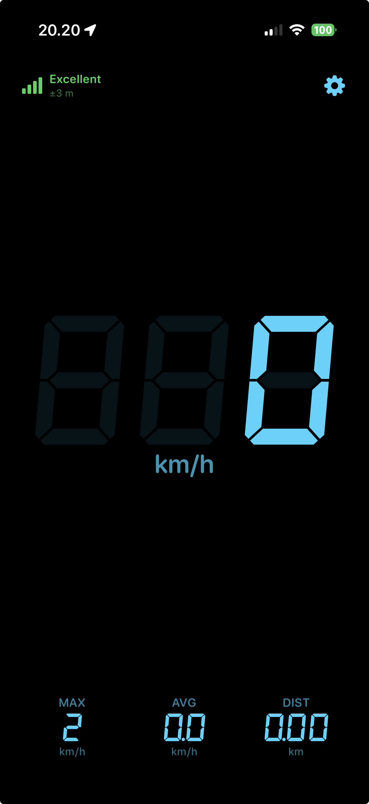

# GPS Speed

A minimalist iOS speedometer built with SwiftUI. It puts a large 7‑segment
current‑speed readout front and centre, with trip stats and live GPS signal
quality — all driven by the device's GPS via `CLLocationManager`.

  

## Features

| | |
|---|---|
| **Current speed** | Large digital readout, the focus of the screen |
| **Trip stats** | Max speed, moving average, total distance |
| **GPS signal quality** | Four‑bar indicator + horizontal accuracy in metres |
| **Units** | Switch between km/h and mph |
| **Display font** | Choose System, or any bundled DSEG 7‑segment style (Regular / Bold / Italic / Bold Italic) |
| **Segment‑display look** | "Off" segments are faintly lit behind the live digits, like a real display; digits stay in fixed positions |
| **Custom colour** | Pick the readout colour (presets + full colour picker) on a fixed black background |
| **Stays awake** | Screen won't sleep while the app is open |

The trip stats and preferences are **in‑memory only** — there is no persistence
by design, so everything resets on launch.

## How it works

- **Location** — `LocationManager` wraps `CLLocationManager`, publishing speed,
  max/average/distance, accuracy and authorization status. Distance and the
  moving average only accumulate above a small speed threshold so GPS jitter
  doesn't inflate them while stationary.
- **Fonts** — `FontLibrary` discovers every font bundled in the app at launch
  (it scans the bundle recursively and registers each via Core Text), so adding
  a `.ttf`/`.otf` to the `GPS Speed/Fonts/` folder is all that's needed to make
  it selectable — no `Info.plist` `UIAppFonts` array required.
- **Readout** — `SpeedReadout` draws the segment "ghost" as two perfectly
  aligned layers (dim `8`s behind, the bright value on top).

## Requirements

- Xcode 16+
- iOS 26.2+ deployment target *(can be lowered — the app only uses iOS 16‑era
  APIs)*
- A physical device for real GPS readings (the Simulator can't produce live
  speed)

## Build & run

1. Open `GPS Speed.xcodeproj` in Xcode.
2. Select your team under **Signing & Capabilities** (the bundle identifier is
   `henril.GPS-Speed`).
3. Build and run on a device.

On first launch the app requests **When In Use** location access
(`NSLocationWhenInUseUsageDescription`); speed and stats appear once it has a
GPS fix.

## Fonts & licensing

The bundled [DSEG](https://github.com/keshikan/DSEG) 7‑segment font by *keshikan*
is licensed under the **SIL Open Font License 1.1**. Its full text is included at
[`GPS Speed/Fonts/OFL.txt`](GPS%20Speed/Fonts/OFL.txt) and ships with the app, as
the licence requires.

The application source code in this repository is the author's own. Add a
`LICENSE` file if you intend others to reuse it.
